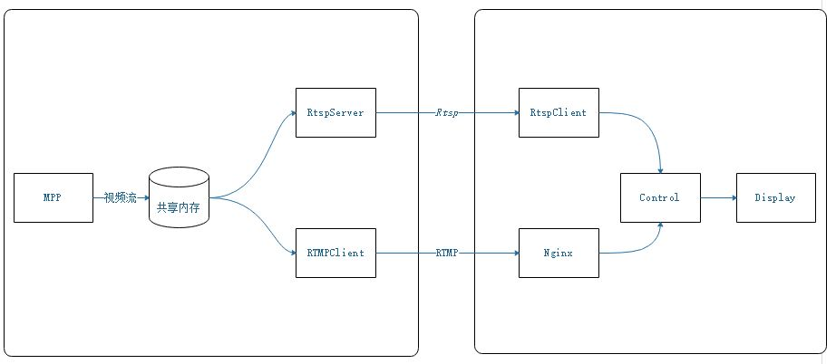

# 目标

基于Hisi3518实现一套流媒体的应用， 平时工作也很忙， 只能下班抽出一些时间来完成。实现这个repository也是对自己的鞭策及回顾， 共勉

# 功能

支持以下功能, 后期再做规划

1. RTSP Server，支持文件/内存读取H264
2. RTMP 推流
3. Qt+FFmpeg, 播放流数据
4. CMake集成编译三方库


# 说明

目前暂不对工程依赖项进行自包含编译， 所有使用的三方库都由个人开发机器环境提供， 后期考虑使用cmake+FindPackage进行管理


# 框图



# 目录结构

```
|--- cmake: cmake文件存放目录
|--- mpp: hisi3518 相关文件目录
|--- package: third-package
|--- pic: picture存放目录
|--- src: 源码文件
	|--- common
	|--- shard-memory
	|--- rtsp
	|--- rtmp
|--- test: 测试文件
```

---

- Name:Jian.Cui(Olin)
- E-Mail: cuijianjoy@126.com
- Address: HangZhou